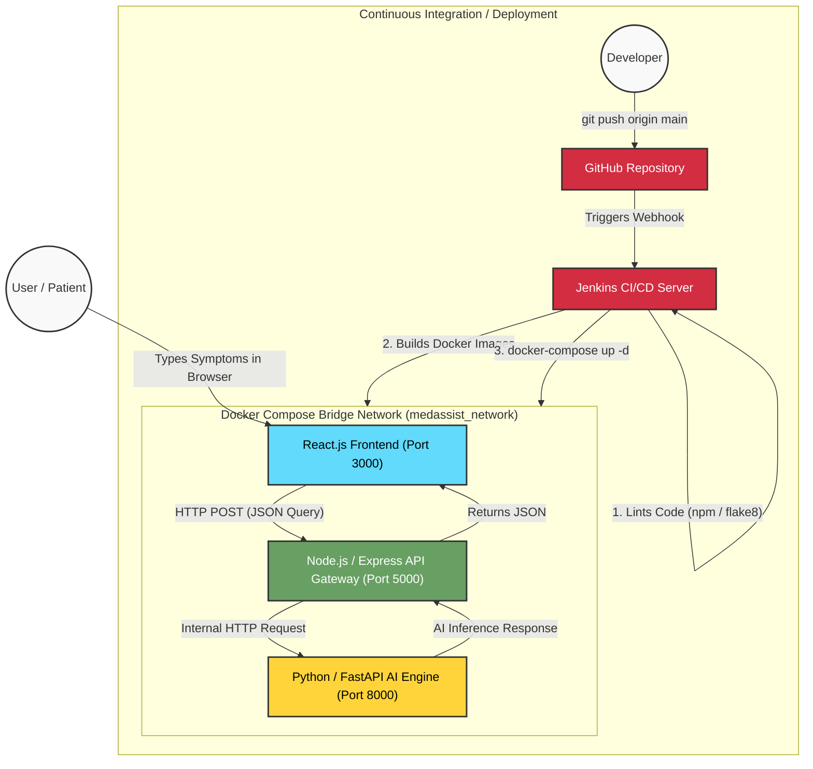

# AI Medical Assistant: Architecture & DevOps Workflow

You can copy this Mermaid diagram code into any Markdown viewer that supports Mermaid (like GitHub, Notion, or an online viewer like [Mermaid Live Editor](https://mermaid.live/)) to instantly generate a visual flowchart of your system architecture!

### How to use this for your presentation:
1. Go to **[mermaid.live](https://mermaid.live/)**
2. Paste the code block above into the "Code" section on the left.
3. The website will instantly generate a clean, colorful diagram on the right.
4. Click the **"Save as PNG"** button at the top right of the website to download the image.
5. Paste the image directly into your PowerPoint presentation!
